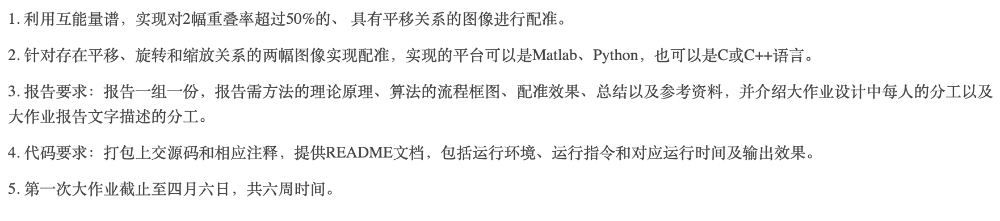

# Requirements:

# References

[Image Registration](https://zhuanlan.zhihu.com/p/80985475)

[Definition of CSD(cross-spectral-density)](https://en.wikipedia.org/wiki/Spectral_density)

[An Image Registration Review](https://www.sciencedirect.com/science/article/pii/S0262885603001379)

[A matlab example using CC method](https://www.mathworks.com/help/images/registering-an-image-using-normalized-cross-correlation.html)

Registration algorithms attempt to align a pattern image over a reference image so that pixels present in both images are in the same lo cation􏸊

# Matlab

https://www.mathworks.com/help/signal/ref/cpsd.html

Attention: Matlab store a image as a row $\times$ Columns matrix. However, to choose an index, the format is (column, row)

Attention: Matlab stores the RGB value in **uint8** format and downcast all the valriables in the same expression with RGB value to uint8 and cause the calculation result to be wrong.

# Question formulation

## Traslational

### Search Area and window

Suppose the picture is of K grey levels, then
$$
S(i,j) \in [0,K-1], \forall i,j\in[1,L] \\
W(l,m) \in [0,K-1], \forall l,m\in[1,M] \\
$$
Denote the upper left corner as the reference point for the position of window
$$
S_M^{i,j}(l,m) = S(i+l-1,j+m-1)
$$
The condition for the window wholly in searching area
$$
l,m\in[1,M]\\
i,j \in[1,L-M+1]
$$
**Translational Registration** is a search over some subset of the allowed range of reference points to find a point $(i^*,j^*)$ which indicates a sub image that is most similiar to given window.

### Correlation method

The correlation(unnormalized) is defined as
$$
R(i,j) = \sum_{l = 1}^M\sum_{m = 1}^MW(l,m)S^{i,j}_M(l,m),i,j \in[1,L-M+1]
$$
It is clear that unnomalized correlation can not be used to registrate, so nomalization is necessary
$$
R^2_N(i,j) = \frac{(\sum_{l = 1}^M\sum_{m = 1}^MW(l,m)S^{i,j}_M(l,m))^2}{(\sum_{l = 1}^M\sum_{m 
= 1}^MW(l,m))^2(\sum_{l = 1}^M\sum_{m = 1}^MS^{i,j}_M(l,m))^2},i,j \in[1,L-M+1]
$$
Basically, the correlation method has a complexity of $\mathcal{O}(n^4)$. Using FFT will improve a lot, but still cost much time, that is where **SSDA(sequential similarity detection algorithms)** comes in.

### SSDA

Every time a reference point is given, there will be $M^2$ multiplications. We call $<W(l,m),S^{i,j}_M(l,m)>$ a *window pair*. The complexity of the primitive algorithm originates from the fact that not every window pair is important and worth $M^2$ times calculation.

SSDA reduces this redundancy by performing a sequential search which may be terminated before all $M^2$ windowing pairs for a particular reference point are tested.

The basic idea of the SSDA is 

1. Define the distance of the pictures
2. Choose a sequence for inceasing-scale image and calculate their distance
3. Set a threshold, and take down the index in sequence that the distance exceeds the threshold.
4. Construct the SSDA surface and check the correlation according to this

#### An example with constant SSDA

Define the distance as:

- Unnormalized
  $$
  d'(i,j,l_n,m_n)=|S^{i,j}_M(l_n,m_n)-W(l_n,m_n)|
  $$

- Normalized

$$
d(i,j,l_n,m_n)=|S^{i,j}_M(l_n,m_n)-W(l_n,m_n)+\hat{W}-\hat{S}(i,j)|\\
\hat{W} = \frac{1}{M^2}\sum_{l = 1}^{M}\sum_{m = 1}^MW(l,m) \\
\hat{S}(i,j) = \frac{1}{M^2}\sum_{l = 1}^{M}\sum_{m = 1}^MS^{i,j}_M(l,m)
$$

We use a constant T as the threshold. The SSDA surface

$$
I(i,j) = \{r | \min_{1\leq r\leq M^2}\{\sum_{n = 1}^r d(i,j,l_n,l_m)\geq T\}\}
$$
Reference points where $I(i,j)$ is large (those which require many windowing pair tests to exceed T) are considered points of similarity,

### Generalization

Now we consider the gerneral situation for registration of translation. We have two images A and B, they have some areas that is common. To registrate two images, we mean finding the translational vector $u = (u_x,u_y)$. We define
$$
(x,y)_A
$$
as the coordinate in A coordination. Then
$$
(x+u_x,y+u_y)_A = (x,y)_B
$$
We do this by the following steps:

#### Choose one window pair

We choose the window pair as:

A_cut(Searching Area): $(x_{A1},y_{A1},x_{A2},y_{A2})_A$

B_cut(Window): $(x_{B1},y_{B1},x_{B2},y_{B2})_B$

#### Update window pair

Using SSDA-like method to update the window pair.

#### Calculate the Correlation and find the peak

Suppose we get the coordinate of the peak $(x_0,y_0)_{A_{cut}}$, then
$$
(x,y)_{B_{cut}} = (x+x_0,y+y_0)_{A_{cut}}
$$

#### Align the image

$$
(x,y)_B = (x-x_{B1},y-y_{B1})_{B_{cut}} = (x-x_{B1}+x_0,y-y_{B1}+y_0)_{A_{cut}} = (x+x_{A1}-x_{B1}+x_0,y+y_{A1}-y_{B1}+y_0)_A \\
\Rightarrow u = (x_{A1}-x_{B1}+x_0,y_{A1}-y_{B1}+y_0)_A
$$

### Rotation and scale

#### The differences between rotation/scale and translation

Unlike the traslational situation, where no loss in data, roatation and scale always need to interpolation and may lose information. Differences for occlusion is considered as an important part.

#### Fourier-Mellin Method

Suppose we have a reference image $r$(the original one) and a pattern image $ p$ related by RST transformation:
$$
r(x,y) = p(\Delta x+s*(x\cos \phi-y\sin\phi),\Delta y+s*(x\sin\phi+y\cos\phi))
$$
  Their frquency is related by 
$$
F_s(\omega_x,\omega_y) = s^2F_p((\omega_x\cos\phi+\omega_y\sin\phi)/s,(-\omega_x\sin\phi+\omega_y\cos\phi)/s )\exp(j2\pi(\omega_x\Delta x+\omega_y\Delta y)/s)
$$
The magnitude of $F_p$ is derived from the magnitude of $F_r$ by rotating Fr by $-\phi$ and shrinking its extent by a factor of $s$.

The translation has its effect the phase rather than on the magnitude, so the magnitude is invariant under the tranlational transform. This is called **Fourier-Mellin Invariance**. The magnitude domain is referred to as the **Fourier-Mellin domain**, denote
$$
R = |F_r| \\
P = |F_p|
$$
By operating in Fourier-Mellin domain, translation is decoupled with rotation and scale, so the next step is to decouple the rotation and scale. This is done by transforming to log-polar space.

#### Log-polar analysis

We transform the Cartesian to polar
$$
\rho = \sqrt{\omega_x^2+\omega_y^2} \\
\theta = \arctan\frac{\omega_y}{\omega_x}
$$
and define a rotation invariant 
$$
S_r(\log \rho) = \frac{1}{\rho}\int_0^\pi R(\rho\cos\theta,\rho\sin\theta)d\theta
$$
Then by correlation of $S_r$, translation parameter can be found. 

We can also tranform R and P both, suppose
$$
M_1(\log\rho,\theta) = R(\omega_x,\omega_y) \\
M_2(\log\rho,\theta) = P(\omega_x,\omega_y) \\
$$
Then we have
$$
M_1(\log\rho,\theta) = M_2(\log\rho-\log s,\theta-\phi)
$$

